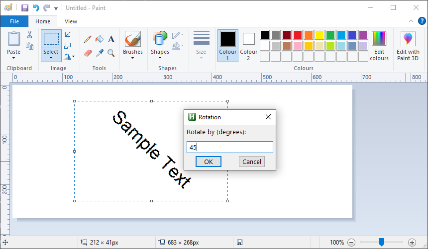

# PaintRotate

An AutoHotKey script that lets you rotate anything in MS Paint

## How to use

1. Install [AutoHotKey](https://www.autohotkey.com/download/) and run the script
2. Select something in MS Paint
3. Press Ctrl + Shift + R and type the amount of degrees you want to rotate the selection with
